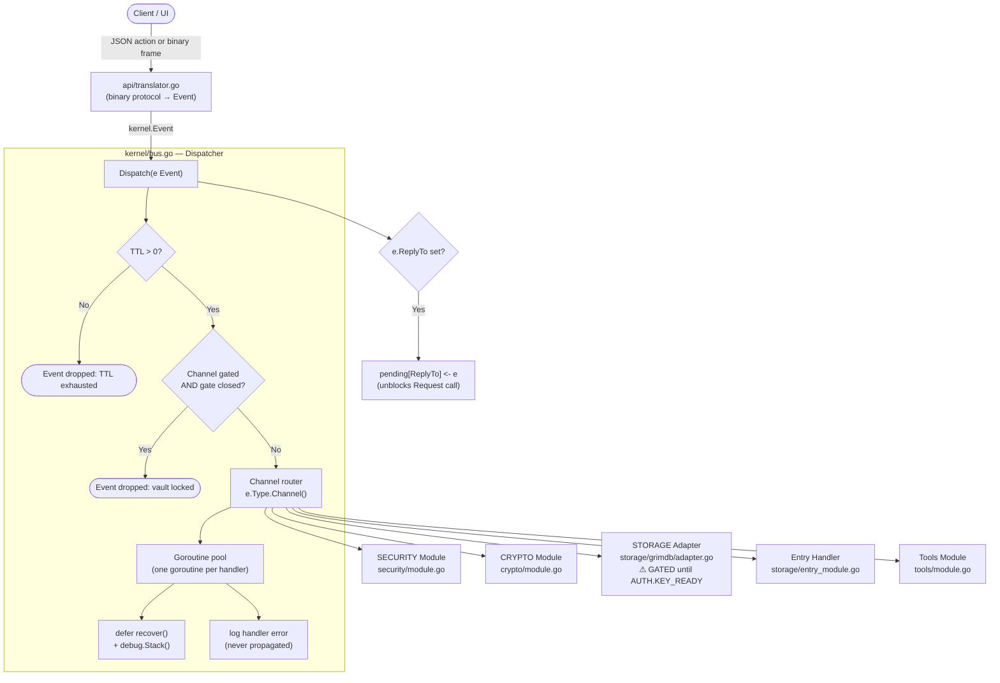
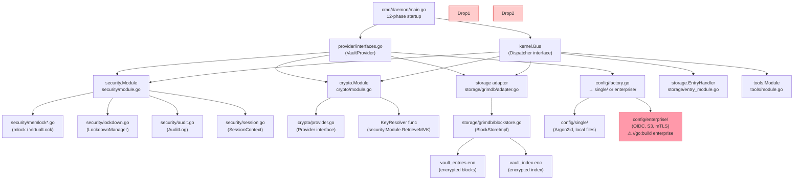
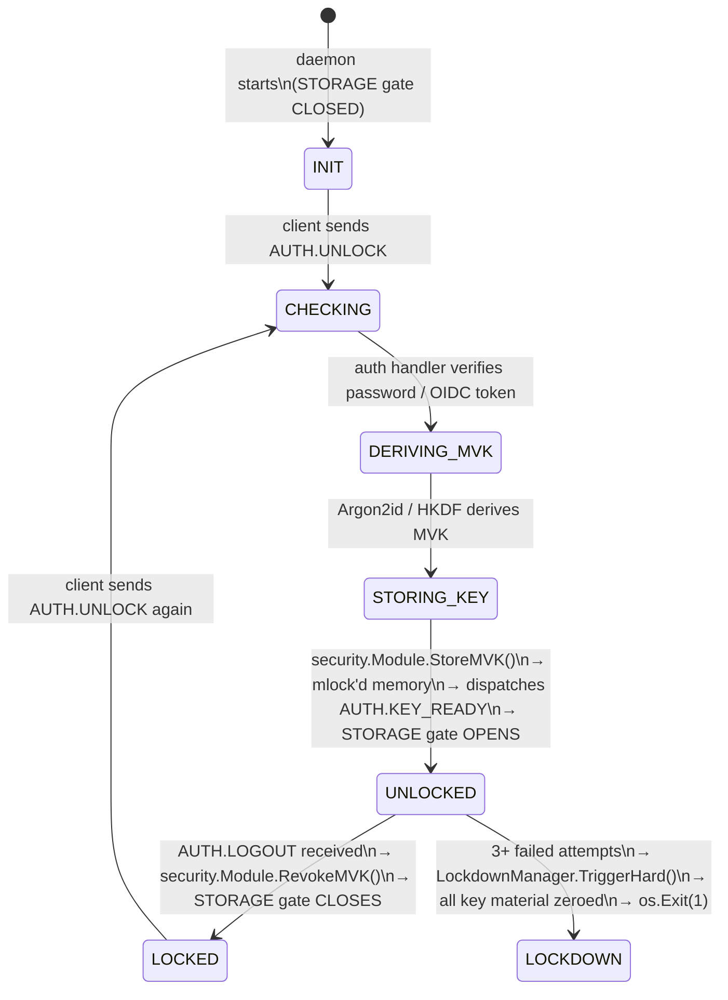

# Grimlocker Omega+ — Architecture Reference

> **Version:** omega-2026-05-30  
> **SLOC:** 12,392+ Go lines across 85 files  
> **Build:** `go build ./...` (single-user) · `go build -tags enterprise ./...` (enterprise)

---

## 1. System Overview

Grimlocker Omega+ is a **zero-trust, event-driven password vault daemon**.  
All inter-module communication flows through a typed event bus. No module ever calls another module's functions directly — this is a hard architectural rule enforced by Go's package boundaries.

```
┌─────────────────────────────────────────────────────────────┐
│                    Tauri UI (ui-layer/)                      │
│              WebSocket (binary) / REST JSON                  │
└─────────────────────┬───────────────────────────────────────┘
                       │
┌─────────────────────▼───────────────────────────────────────┐
│                  grimdb Daemon (Go)                          │
│                                                              │
│  ┌─────────────┐  ┌──────────────┐  ┌──────────────────┐   │
│  │ api/         │  │ kernel/      │  │ security/        │   │
│  │ translator   │  │ bus.go       │  │ module.go        │   │
│  │ ipc/server   │──│ (Dispatcher) │──│ MVK + lockdown   │   │
│  │ websocket/   │  │              │  │ audit + memlock  │   │
│  └─────────────┘  └──────┬───────┘  └──────────────────┘   │
│                           │                                  │
│              ┌────────────┼────────────┐                     │
│              │            │            │                     │
│  ┌───────────▼─┐  ┌───────▼──┐  ┌────▼──────────────┐      │
│  │ crypto/     │  │ storage/ │  │ tools/             │      │
│  │ module.go   │  │ grimdb/  │  │ module.go          │      │
│  │ (CRYPTO.*)  │  │ (STORAGE)│  │ (TOOL.SSH_GEN)     │      │
│  └─────────────┘  └──────────┘  └────────────────────┘      │
│                                                              │
└─────────────────────────────────────────────────────────────┘
                       │
┌─────────────────────▼───────────────────────────────────────┐
│              core-rust (Rust Enclave, CGO bridge)            │
│           cgo/rustbridge.go → libgrimcore                    │
└─────────────────────────────────────────────────────────────┘
```

---

## 2. Event Bus Architecture

**File:** `kernel/bus.go` (315 lines)

The bus is the nervous system of the daemon. Every module registers on it; no module holds a reference to any other module.

### 2a. Event Flow Diagram



### 2b. Handler Registration Patterns

There are **two registration patterns** in use:

#### Pattern A — kernel.Module (stateful, registered via `bus.Register`)

Used by: `security.Module`, `crypto.Module`, storage adapter, `tools.Module`

```
bus.Register(module) 
  → stores Module in channelHandlers[channel]
  → on dispatch: module.Handle(event) is called
  → module internally routes to buildHandlers() registry
```

#### Pattern B — Direct Subscription (stateless, via `bus.Subscribe`)

Used by: AUTH.UNLOCK handler, AUTH.KEY_READY, AUTH.LOGOUT, ENTRY.* handlers

```
bus.Subscribe(EvAuthUnlock, vault.Auth().HandleUnlockEvent(...))
  → stored in typeHandlers[EventType]
  → on dispatch: handler func(Event) error called directly
```

### 2c. Request / Response Pattern

For synchronous calls (e.g., vault unlock waiting for result):

```
caller → bus.Request(ctx, event)
  → sets event.ID = UUID
  → creates replyCh = make(chan Event, 1)
  → stores pending[event.ID] = replyCh
  → calls Dispatch(event)
  → blocks on select{case reply := <-replyCh ...}

handler → bus.Dispatch(ReplyEvent(origin, resultType, reqEvent, payload))
  → Dispatch sees e.ReplyTo != ""
  → signals pending[e.ReplyTo] <- replyEvent
  → caller unblocks and returns reply
```

---

## 3. Module Dependency Graph



---

## 4. Startup Sequence (12 Phases)

**File:** `cmd/daemon/main.go` (~540 lines)

| Phase | Code Location | Action |
|-------|--------------|--------|
| 0 | `rustbridge.InitCore()` | Initialize Rust secure enclave (CGO bridge). Falls back to Go crypto on failure. |
| 1 | `grimdb.NewGrimDB(dbPath)` | Open file-backed GrimDB blockstore |
| 1b | `config.NewSingleUserProvider(cfg, db)` | Create Tier Provider (single-user default; enterprise via `-tags enterprise`) |
| 2 | `kernel.NewBus(WithGatedChannels("STORAGE"))` | Create Event Bus. STORAGE channel is GATED until vault unlocked. |
| 2b | `security.NewSessionContext()` | Create global vault-unlock state tracker |
| 3-5 | `vault.KernelModules()` → `reg.Add(mod)` | Register SECURITY → CRYPTO → STORAGE modules (order matters!) |
| 5b | `storage.NewEntryHandler(blockStore)` | Create entry CRUD handler |
| 5c | `tools.NewModule(blockStore)` | Register SSH key generation tool |
| 6 | `bus.Subscribe(EvAuthUnlock, ...)` | Wire vault unlock handler |
| 7 | `reg.StartAll(ctx)` | Start all registered modules (Start() called on each) |
| 7a | `bus.Subscribe(EvAuthKeyReady, OpenGate)` | On unlock success: open STORAGE gate |
| 7b | `bus.Subscribe(EvAuthLogout, CloseGate)` | On logout: close STORAGE gate + lock session |
| 8 | `mustCookie()` + `GenerateSecureToken()` | Generate WebSocket origin cookie + session token |
| 9 | `api.NewTranslator(...)` | Create binary↔Event translator (WebSocket protocol) |
| 10 | `apiipc.NewServer(...)` | Create Unix socket IPC server (non-Windows) |
| 11 | `startTierListener(...)` | Start HTTP listener (tier-specific port/TLS config) |
| 12 | `signal.Notify(shutdownCh, SIGINT, SIGTERM)` | Register graceful shutdown handler |

---

## 5. Session / Lock-Management

**Files:** `security/session.go`, `kernel/bus.go`



**Gate behavior:**
- `bus.gatedChannels = {"STORAGE": true}` — set at startup
- `bus.gateOpen = false` — STORAGE events silently dropped
- `AUTH.KEY_READY` → `bus.OpenGate()` → STORAGE events flow
- `AUTH.LOGOUT` → `bus.CloseGate()` + `sessionCtx.Lock()`

---

## 6. Tier Abstraction (Build-Tag Isolation)

**File:** `provider/interfaces.go`

```
VaultProvider interface
├── Auth() AuthProvider
│   ├── single/auth.go   (LocalAuth — Argon2id → MVK)
│   └── enterprise/auth.go  (OIDCProvider — JWT RS256 → MVK)   [//go:build enterprise]
│
├── Storage() StorageProvider  ← extends storage.BlockStore
│   ├── storage/grimdb/blockstore.go  (file-backed, ChaCha20-Poly1305)
│   └── storage/remote/vault.go       (S3/MinIO backend)         [//go:build enterprise]
│
├── Crypto() crypto.Provider
│   ├── crypto/provider.go   (pure Go: Argon2id, ChaCha20, HKDF)
│   └── cgo/rustbridge.go    (Rust enclave via CGO)              [enterprise]
│
└── KernelModules() []kernel.Module
    └── Returns [security.Module, crypto.Module, storage adapter]
```

Enterprise code is **completely excluded** from the single-user binary via Go build tags:
```
config/enterprise/*.go    //go:build enterprise
storage/remote/*.go       //go:build enterprise
security/mtls/*.go        //go:build enterprise
api/mtls/*.go             //go:build enterprise
```

---

## 7. SLOC Metrics (as of 2026-05-30)

| Module | Files | SLOC | Criticality | Primary Risk |
|--------|-------|------|-------------|--------------|
| `storage/` | 20 | 3,460 | 🔴 CRITICAL | Block corruption, index decrypt failure |
| `cmd/` | 8 | 1,391 | 🟠 HIGH | Startup sequencing, graceful shutdown |
| `api/` | 11 | 1,200+ | 🟠 HIGH | Protocol parsing, WebSocket session |
| `security/` | 11 | 1,227 | 🔴 CRITICAL | MVK in locked memory, lockdown |
| `config/` | 9 | 1,072 | 🟡 MEDIUM | Tier selection, provider wiring |
| `crypto/` | 10 | 579 | 🟠 HIGH | Key derivation, encryption ops |
| `kernel/` | 6 | 313 | 🔴 CRITICAL | Event routing, gate mechanism |
| `cgo/` | 1 | 390 | 🟠 HIGH | Rust enclave FFI, fallback path |
| `sdk/` | 6 | 200 | 🟢 LOW | Plugin interfaces |
| `tools/` | 3 | 70 | 🟢 LOW | SSH key generation |
| `provider/` | 1 | 94 | 🟡 MEDIUM | Interface contracts |
| `errors/` | 3 | 400 | 🔴 CRITICAL | All error types + logging |
| **Total** | **89** | **~12,800** | | |

---

## 8. API Endpoints

**File:** `cmd/daemon/listener_single.go`, `api/translator.go`

| Endpoint | Method | Description |
|----------|--------|-------------|
| `/api/v1` | POST | JSON event dispatch: `{"action":"vault.unlock","payload":{...}}` |
| `/init` | POST | Vault initialization (headless / CLI first-run) |
| `/shutdown` | POST | Graceful shutdown (Tauri calls before SIGKILL) |
| `/health` | GET | `{status, tier, version, vault_unlocked, pid}` |
| `/ws` | GET | WebSocket upgrade — binary protocol frame |

**WebSocket Binary Protocol** (`api/ipc/protocol.go`):
- Frame: `[4-byte length][message-type byte][JSON payload]`
- Session key (SKE) encrypts payloads after unlock
- Handshake sends `vault_unlocked: true/false` for reconnect-without-reauth

---

## 9. Critical File Map

| File | Purpose | Lines |
|------|---------|-------|
| `cmd/daemon/main.go` | 12-phase daemon startup | ~540 |
| `kernel/bus.go` | Event bus, gate, dispatcher | ~315 |
| `kernel/event.go` | All 33+ EventType constants, Event struct | ~120 |
| `security/module.go` | MVK table, lockdown, audit | ~310 |
| `security/session.go` | Vault unlock state | ~123 |
| `security/lockdown.go` | Soft/Hard lockdown with entropy overwrite | ~154 |
| `storage/grimdb/blockstore.go` | Encrypted file block store | ~447 |
| `storage/entry_module.go` | Entry CRUD handler | ~280 |
| `crypto/module.go` | CRYPTO event handlers | ~175 |
| `api/translator.go` | WebSocket binary ↔ Events | ~400 |
| `api/handlers/entry_handler.go` | File upload (io.Pipe, 3-phase) | ~300 |
| `config/single/auth.go` | Argon2id unlock (7-step) | ~150 |
| `config/enterprise/auth.go` | OIDC JWT unlock | ~250 |
| `errors/types.go` | Typed GrimlockError system | ~200 |
| `errors/stacktrace.go` | Runtime stacktrace capture | ~50 |
| `errors/logging.go` | StructuredLogger interface | ~100 |
| `docs/ARCHITECTURE.md` | This file | ~300 |
| `docs/DEBUGGING.md` | Troubleshooting guide | ~250 |
| `docs/ERROR_CODES.md` | Error code reference | ~200 |

---

## 10. Graceful Shutdown Order

`cmd/daemon/main.go` shutdown sequence on SIGINT/SIGTERM or `/shutdown`:

```
1. blockStore.Flush()          — persist encrypted index
2. sessionCtx.Lock()           — revoke MVK from locked memory
3. sessionCtx.SessionDestroy() — zero session key
4. bus.Shutdown(ctx)           — Stop() all registered modules
   └─ security.Module.Stop()   — zero all remaining mvkHandles
```

---

## 11. Security Properties

| Property | Implementation | File |
|----------|---------------|------|
| MVK never on heap | `security.guard.AllocLocked()` via mlock/VirtualLock | `security/memlock*.go` |
| Encrypted-at-rest | ChaCha20-Poly1305 + per-block nonce | `storage/grimdb/blockstore.go` |
| Block integrity | HMAC-SHA256 on (id ‖ nonce ‖ ciphertext) | `blockstore.go:deriveHMACKey()` |
| Index integrity | Same ChaCha20-Poly1305 envelope | `blockstore.go:persistIndexLocked()` |
| Timing-safe compare | `crypto/subtle.ConstantTimeCompare` | `security/constant_time.go` |
| Lockout protection | `LockdownManager` (soft/hard threshold) | `security/lockdown.go` |
| Entropy overwrite | `crypto.Shred()` on hard lockdown | `security/module.go:overwriteEntropy()` |
| mTLS | SPKI pinning + TLS 1.3 | `security/mtls/certmanager.go` |

---

*Generated from codebase analysis — keep in sync when adding new modules or event types.*
