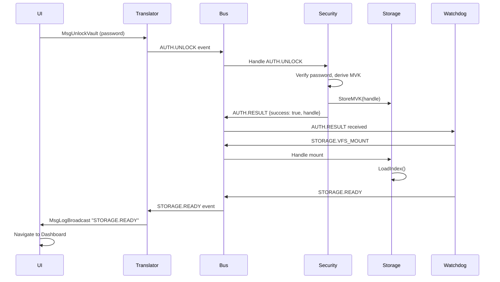
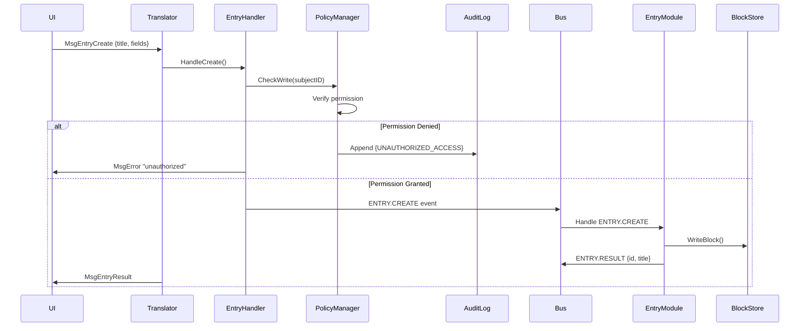
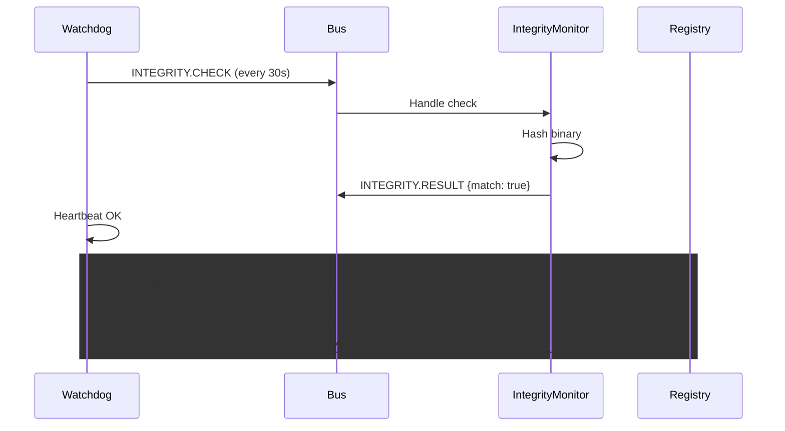

# Grimlocker Omega+ — API Flow Diagrams

## 1. Vault Unlock & VFS Auto-Mount



## 2. File Ingest via io.Pipe Streaming

```mermaid
sequenceDiagram
    UI->>Translator: MsgFileIngestBegin {name, mime, size}
    Translator->>EntryHandler: HandleIngestBegin()
    EntryHandler->>EntryHandler: Create io.Pipe()
    EntryHandler->>IngestEngine: Start Ingest(pr, name, mime, progressFn)
    IngestEngine->>IngestEngine: Read chunks, encrypt, write blocks
    EntryHandler->>UI: MsgAck "ready"
    UI->>Translator: MsgFileChunk[0] (4MB data)
    Translator->>EntryHandler: HandleChunk()
    EntryHandler->>EntryHandler: pw.Write(chunk)
    IngestEngine->>IngestEngine: Decrypt fails; re-encrypt with MVK
    Translator->>UI: MsgIngestProgress {pct: 0.25}
    UI->>Translator: MsgFileChunk[1]
    Translator->>EntryHandler: HandleChunk()
    Translator->>UI: MsgIngestProgress {pct: 0.50}
    ... more chunks ...
    UI->>Translator: MsgFileIngestEnd
    Translator->>EntryHandler: HandleIngestEnd()
    EntryHandler->>EntryHandler: pw.Close() → EOF
    IngestEngine->>IngestEngine: Finalize, write BlobManifest
    Translator->>UI: MsgEntryResult {manifest}
    UI->>UI: Display file in vault
```

## 3. CRUD with Policy Validation



## 4. Watchdog Heartbeat & Recovery



## 5. Audit Log Cryptographic Chaining

Each SecurityEvent includes:
- `hash = SHA-256(prevHash || timestamp || level || module || message || subjectID)`
- `prevHash` references the previous entry's hash
- Forms an immutable cryptographic chain

Example:
```
Entry 1: hash = SHA-256(0...0 || 1234 || INFO || policy || "LOGIN" || "user1")
Entry 2: hash = SHA-256(Entry1.hash || 5678 || CRITICAL || policy || "UNAUTHORIZED_ACCESS" || "hacker")
Entry 3: hash = SHA-256(Entry2.hash || 9012 || INFO || storage || "FILE_WRITTEN" || "user1")
```

If Entry 2 is tampered with, Entry 3's prevHash no longer matches its recomputed value.

## Message Flow Summary

| Message | Direction | Handler | Purpose |
|---------|-----------|---------|---------|
| `MsgFileIngestBegin` | Client→Server | `EntryHandler.HandleIngestBegin` | Start file upload |
| `MsgFileChunk` | Client→Server | `EntryHandler.HandleChunk` | Stream file data |
| `MsgFileIngestEnd` | Client→Server | `EntryHandler.HandleIngestEnd` | Complete upload |
| `MsgIngestProgress` | Server→Client | `Translator` (pushed) | Report progress |
| `MsgEntryCreate` | Client→Server | `EntryHandler.HandleCreate` | New entry |
| `MsgEntryUpdate` | Client→Server | `EntryHandler.HandleUpdate` | Modify entry |
| `MsgEntryDelete` | Client→Server | `EntryHandler.HandleDelete` | Remove entry |
| `MsgEntryResult` | Server→Client | `Translator` | CRUD result |
| `MsgLogBroadcast` | Server→Client | `Translator` (pushed to all) | Security/lifecycle events |
